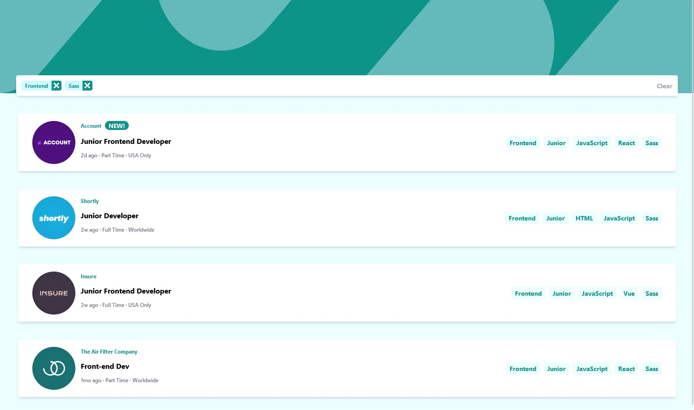

# Frontend Mentor - Job listings with filtering solution

This is a solution to the [Job listings with filtering challenge on Frontend Mentor](https://www.frontendmentor.io/challenges/job-listings-with-filtering-ivstIPCt).

## Table of contents

- [Overview](#overview)
  - [The challenge](#the-challenge)
- [My process](#my-process)
  - [Built with](#built-with)
  - [What I learned](#what-i-learned)
  - [Useful resources](#useful-resources)
- [Author](#author)

## Overview

### The challenge

Make application with following features:
- dynamic filtering over list of jobs
- every job offer has:
  - data about recruting company, position, role, level, contract, location, coding language, required tools and coresponding logo 
  - languages and tools acts as filters 

## My process

### Built with

- Semantic HTML5 markup
- Tailwind
- Flexbox
- Mobile-first workflow
- [React](https://reactjs.org/) - JS library

### What I learned
React: filter, some, every, maping conditional rendering images in header.
CSS: This is also my first time using Tailwind as only source of CSS. 

### Useful resources

- [Rendering images](https://itnext.io/responsive-background-images-using-react-hooks-941af365ea1f) - This helped me understand how dynamic rendering works. When i used only conditional render of image used in header it changed only when page refresh. With use of useEffect function was able to change state dynamicaly.
- [Tailwind cheatsheet](https://nerdcave.com/tailwind-cheat-sheet) - Saved me ton of time with searching for classes i needed.

## Author

- Frontend Mentor - [@@molszewski34](https://www.frontendmentor.io/profile/molszewski34)
- Github - https://github.com/molszewski34

